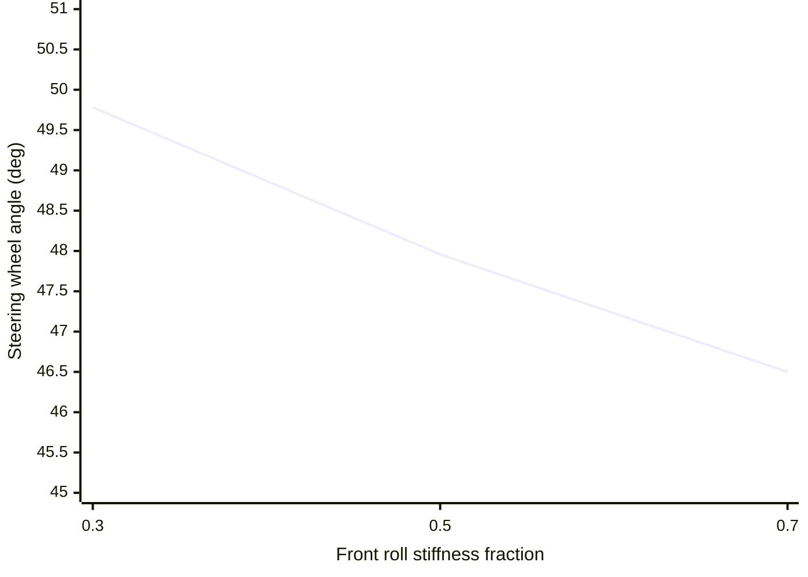

# Phase 2 lateral demo evidence

Reproduce the measurements with `uv run python` using
`load_car_spec().kernel_config()` and the scenarios described below. These runs are deterministic
model evidence; the tire, aero and suspension coefficients are synthetic and untuned.

## Four-corner load transfer

The standard 20 m/s, 50 m neutral left-hand circle requests the geometric steering angle and runs
for 1.0 s. Its final recorded ground-truth sample reports:

| Corner | Vertical load (N) |
| --- | ---: |
| FL | 1,671.9 |
| FR | 2,341.9 |
| RL | 2,077.6 |
| RR | 2,538.7 |

All four values are positive and unequal, showing lateral load transfer in the simulated turn.
The rear-right corner is most loaded in this left turn. The configured suspension travel-limit
flags remain clear throughout the scenario.

## Constant-radius speed sweep

Each point starts at the listed speed, coasts in neutral for 2.5 s, and targets a 200 m radius
after its lateral response settles. The car slows during each run, so the table also shows its
mean speed over the final 150 ms. Acceleration, steering and wheel loads are averaged over that same
tail; loads are N in `FL, FR, RL, RR` order.

| Initial speed (m/s) | Tail speed (m/s) | Measured radius (m) | Lateral acceleration (g) | Steering wheel (deg) | Mean wheel loads (N) |
| ---: | ---: | ---: | ---: | ---: | --- |
| 40 | 36.34 | 200.00 | 0.681 | 11.548 | 2,282 / 2,884 / 2,727 / 3,140 |
| 50 | 44.47 | 200.00 | 1.025 | 11.096 | 2,572 / 3,477 / 3,100 / 3,722 |
| 60 | 52.24 | 200.00 | 1.425 | 10.449 | 2,923 / 4,181 / 3,553 / 4,419 |
| 70 | 59.69 | 200.00 | 1.888 | 9.566 | 3,332 / 4,998 / 4,087 / 5,234 |
| 80 | 67.05 | 200.01 | 2.400 | 8.414 | 3,790 / 5,908 / 4,687 / 6,145 |
| 95 | 77.93 | 200.00 | 3.183 | 6.771 | 4,641 / 7,450 / 5,780 / 7,713 |
| 105 | 85.05 | 199.96 | 3.697 | 5.773 | 5,297 / 8,560 / 6,606 / 8,852 |

The table reports coasting tail speeds; the initial 105 m/s value is 378 km/h and remains below
the `vx` and `speed` channel maxima. The declared illustrative `downforce_n` span was widened to
40 kN because the earlier 30 kN maximum clipped the actual 34 kN output; its quantization full
scale was widened with it.

## Steering sensitivity

At 20 m/s and 50 m radius, the steering input was bisected to match the same measured circle while
only `roll_stiffness_front_fraction` changed. Values below are steering-wheel degrees:

| Front roll stiffness fraction | Steering wheel (deg) |
| ---: | ---: |
| 0.3 | 49.781 |
| 0.5 | 47.958 |
| 0.7 | 46.499 |

This confirms monotonic balance sensitivity in this scenario. It is not an understeer-gradient
calibration and does not vary an aero balance that the current configuration does not model.

## Interpretation and remaining gate

Pirelli reported 4G lateral acceleration at Spa's Pouhon for a 2011 F1 car at 290 km/h
([source](https://press.pirelli.com/the-belgian-gran-prix-from-a-tyre-point-of-view/)). The 4.0 g
reference is historical context only: the settled neutral 200 m run reaches 3.697 g from a 105 m/s
start, and uses different car, corner, aero, surface and tire conditions. The earlier 4.108 g was
a transient before sideslip settled. A matched source-backed target is still needed before P2
calibration can be called complete. Initial advisory goldens are committed for the steady circle
and 105 m/s sweep endpoint. They capture the present synthetic, untuned coefficients and are not
calibration targets.
