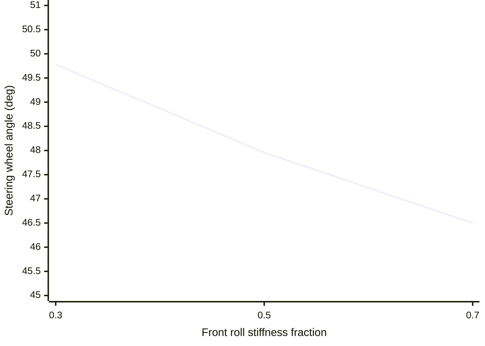

# Phase 2 lateral demo evidence

Reproduce the measurements with `uv run python` using
`load_car_spec().kernel_config()` and the scenarios described below. These runs are deterministic
model evidence; the tire, aero and suspension coefficients are synthetic and untuned.

## Four-corner load transfer

The standard 20 m/s, 50 m neutral left-hand circle requests the geometric steering angle and runs
for 1.0 s. Its final recorded ground-truth sample reports:

| Corner | Vertical load (N) |
| --- | ---: |
| FL | 1,671.9 |
| FR | 2,341.9 |
| RL | 2,077.6 |
| RR | 2,538.7 |

All four values are positive and unequal, showing lateral load transfer in the simulated turn.
The rear-right corner is most loaded in this left turn. The configured suspension travel-limit
flags remain clear throughout the scenario.

## Constant-radius speed sweep

Each point is a separate 0.5 s neutral run targeting a 200 m radius. The shown acceleration and
steering values are means or final input over the last 150 ms. Final corner loads are N in
`FL, FR, RL, RR` order.

| Initial speed (m/s) | Measured radius (m) | Lateral acceleration (g) | Steering wheel (deg) | Final wheel loads (N) |
| ---: | ---: | ---: | ---: | --- |
| 40 | 200.50 | 0.745 | 11.470 | 2,392 / 3,066 / 2,860 / 3,323 |
| 50 | 199.66 | 1.118 | 11.128 | 2,796 / 3,820 / 3,367 / 4,072 |
| 60 | 200.61 | 1.548 | 10.649 | 3,338 / 4,766 / 4,044 / 5,027 |
| 70 | 199.31 | 2.054 | 10.238 | 3,984 / 5,889 / 4,855 / 6,166 |
| 80 | 200.66 | 2.594 | 9.690 | 4,773 / 7,191 / 5,840 / 7,504 |
| 95 | 199.99 | 3.490 | 8.868 | 6,150 / 9,432 / 7,550 / 9,809 |
| 105 | 199.72 | 4.108 | 8.252 | 7,237 / 11,127 / 8,891 / 11,568 |

The final point is 378 km/h, below the `vx` and `speed` channel maxima. The declared illustrative
`downforce_n` span was widened to 40 kN because the previous 30 kN maximum clipped the actual
34 kN output at this point; its quantization full scale was widened with it.

## Steering sensitivity

At 20 m/s and 50 m radius, the steering input was bisected to match the same measured circle while
only `roll_stiffness_front_fraction` changed. Values below are steering-wheel degrees:

| Front roll stiffness fraction | Steering wheel (deg) |
| ---: | ---: |
| 0.3 | 49.781 |
| 0.5 | 47.958 |
| 0.7 | 46.499 |

This confirms monotonic balance sensitivity in this scenario. It is not an understeer-gradient
calibration and does not vary an aero balance that the current configuration does not model.

## Interpretation and remaining gate

Pirelli reported 4G lateral acceleration at Spa's Pouhon for a 2011 F1 car at 290 km/h
([source](https://press.pirelli.com/the-belgian-gran-prix-from-a-tyre-point-of-view/)). The 4.0 g
floor is historical plausibility context only: this neutral 200 m simulation has different car,
corner, aero, surface and tire conditions. A matched source-backed target is still needed before
P2 calibration can be called complete. Initial advisory goldens are committed for the steady circle
and 105 m/s sweep endpoint. They capture the present synthetic, untuned coefficients and are not
calibration targets.
