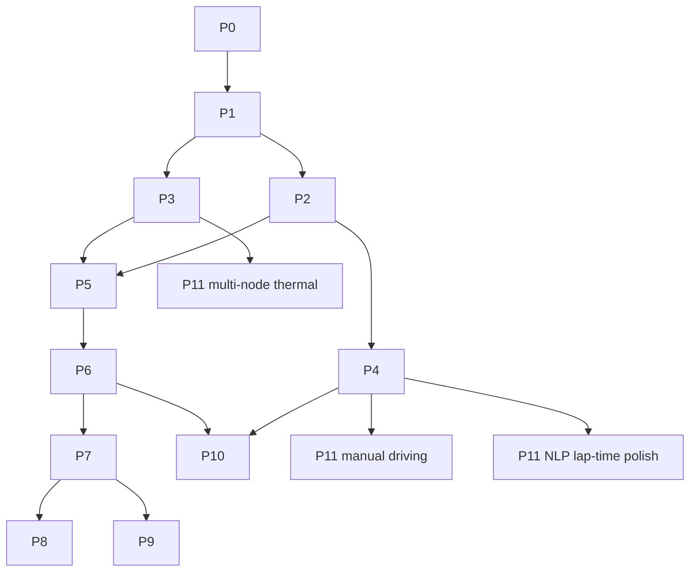

# All Pending Phases Implementation Plan

> **Execution:** The parent orchestrator owns delegation, integration, review, and evidence. Keep phase checkboxes open until their gates pass with recorded evidence. Use the existing tasks in [`PHASES.md`](../../../PHASES.md) as the detailed implementation specification.

**Goal:** Close every still-open phase gate, from P0 gate reconciliation through P11, as one sequenced implementation effort; report the work complete only after every included phase gate passes.

**Architecture:** Retain the phase boundaries and requirements in `PHASES.md` and `PLAN.md`; this document supplies the unified dependency order, current open-gate ledger, and a strict completion contract. Complete dependent foundations first, then run only the parallel workstreams allowed by the dependency graph. Each phase produces code, evidence from the approved non-SSH environment, an updated gate record, and its own commit/tag before dependent phases can close.

**Tech Stack:** Python 3.12, `uv`, Numba, NumPy, pytest, Ruff, basedpyright, PyArrow, React/TypeScript/Vite, WebSocket, and Parquet.

**Spec:** [`PHASES.md`](../../../PHASES.md) and [`PLAN.md`](../../../PLAN.md). Current combined checkpoint: [`docs/phase3-5-demo.md`](../../phase3-5-demo.md).

## Global Constraints

- Do not use SSH, SCP, or remote-shell commands. The user selected GitHub Actions on `feat/phase-2` as the approved verification route and authorized pushing milestone commits.
- The existing instruction prohibits local Python, tests, simulations, benchmarks, and web builds. Run gates only in the approved GitHub Actions environment; do not run them locally or bypass them.
- Keep the fixed-step simulation deterministic; do not add wall-clock reads or allocations to the Numba kernel.
- Preserve the one-way physics import boundary, validated contract inputs, and coefficient provenance requirements in `PLAN.md`.
- Use the thresholds and scope in `PHASES.md` and `PLAN.md`. Do not invent or loosen acceptance limits after seeing results.
- Pin source-backed, configuration-matched calibration targets and measurement methods before tuning. If no valid target or tolerance can be supported, leave that gate open and report the blocker.
- The parent orchestrator owns scope and integration. The user selected Claude Sonnet 5.5 for delegated work; assign bounded, non-overlapping tasks and review every result before integration.
- Commit each gate-passing phase separately. Apply its phase tag only after its exit gate passes.

## Review Focus

- A coarse or mismatched reference is not a calibration pass: the 2.32 s 0–100 km/h observation and 4.0 g historical cornering reference have explicit limitations.
- A transient speed trap is compared with the scenario maximum, never terminal speed.
- Fictional track fixtures and retained track CSVs do not by themselves prove real-circuit line validity.
- Finite stress runs and passing unit tests prove behavior, not physical calibration.
- Dashboard build success does not prove live/replay parity, browser usability, or latency.

---

## Completion Contract

This is one umbrella plan with phase-level gates. A phase is **passed** only when all its `PHASES.md` exit criteria are met, required focused and full-suite checks pass in the user-approved non-SSH execution environment, its demo or evaluation evidence is recorded, and its status/tag is updated. “Implemented,” “tests pass,” or “almost done” are not terminal states.

The umbrella plan is **complete only when P0–P11 have each passed**, including all three P11 slices. P9 may pass with a measured, honestly reported result that Isolation Forest does not beat Layer 2 plus persistence, as the existing specification allows. A blocked source-data or acceptance-target question keeps its phase and the umbrella plan open; it does not authorize substituting an easier gate.

For each phase, keep an evidence record in the existing phase/checkpoint documentation containing:

1. Commit SHA and execution-environment checkout revision.
2. Exact commands and exit status for focused checks, full checks, and scenario/demo runs.
3. Seeds, scenario/setup versions, data sources, and measured outputs needed to reproduce the result.
4. The actual metric and threshold comparison, including uncertainty and limitations.
5. A short visual/manual artifact for gates requiring a real-circuit comparison or dashboard demonstration.

If any item fails, leave the phase open, fix the cause, rerun the affected checks in GitHub Actions, and repeat the gate review. Do not tag or declare the combined work complete while any required gate is open.

## Current Gate Ledger

This is a planning snapshot from 2026-10-06. It does not change the source checkboxes; implementation must reconcile those checkboxes with evidence as each phase closes.

| Phase | Snapshot | Remaining closure work |
|---|---|---|
| P0 — contracts/tooling | Gate checkboxes are still open in `PHASES.md`; verify whether the existing implementation has retained evidence for every criterion. | Prove the synthetic dashboard rate contract, codegen idempotence, all eight invariants, rate-change propagation, and CI checks. Reopen/fix any missing item. |
| P1 — straight-line physics | Implemented in part; exit gate explicitly remains open. Determinism is evidenced, but launch calibration misses its coarse reference. | Freeze valid acceptance references first; close the performance, power-curve, invariant, and independent-comparison criteria. |
| P2 — lateral/load transfer | Implemented in part; core mechanics checks pass, but no source-backed configuration-matched lateral-g target is set. | Select and freeze a comparable target/method, then close the calibration gate without treating the unmatched 4.0 g historical value as a target. |
| P3 — lumped thermal | Implemented and VM-tested; operating-temperature calibration remains open. | Establish source-backed equilibrium bands per compound/surface and pass the thermal soak/cooldown evidence. |
| P4 — track/lap | Implementation exists; reference-driver completion and real-circuit visual validation remain open. Current active fixtures are fictional. | Run valid reference-driver laps and compare the optimized line on a real circuit with cited evidence. |
| P5 — sensors/bus/storage/replay | Software path is implemented and VM-tested; dashboard live/replay demonstration remains open. | Demonstrate saved replay through the dashboard alongside live behavior and retain parity evidence. |
| P6 — scenario framework | Not closed. | Deliver all scenario, headless-speed, profiling, manifest, and parameter-sweep gates. |
| P7 — residual analytics | Not closed. | Deliver the generated evaluation table, clean negative control, persistence comparison, correct localization, and traceable claims. |
| P8 — dashboard | Not closed. | Deliver all panels, measured latency, two-run comparison, rendering-rate proof, and browser demonstration. |
| P9 — ML upgrade | Stretch phase, pending. | Compare Isolation Forest with the classical baseline on held-out faults; publish either improvement or a measured non-improvement. |
| P10 — setup DoE/surrogate | Stretch phase, pending. | Run the parameter sweep, train/evaluate on a frozen split, re-simulate the predicted optimum, and publish error. |
| P11 — polish | Open and split into three independent slices by the existing plan. | Complete multi-node thermal, manual-driving/force-feedback input, and NLP lap-time polish, each with a gate. |

## Dependency Order



The arrows show **phase-closure dependencies**, not a ban on preparatory work. P2 and P3 implementation can proceed in parallel once the P1 interfaces they consume are stable; neither gate can pass before P1 passes. P4 and P5 implementation can overlap once their P2/P3 interfaces are stable; their gates wait for those prerequisites. P6 and P7 implementation can overlap after the P5 data/storage contracts are stable, but P7 evaluation and closure wait for P6's parameterized scenario sweep. P8 panels may be built against synthetic data while replay/anomaly feeds are in progress, but P8 cannot pass before P5 and P7. P9 follows P7, P10 follows both P4 and P6, and each P11 slice follows its listed prerequisite. The orchestrator checks upstream status again before accepting downstream evidence.

## Phase Work and Exit Gates

Use each phase’s task IDs, file scope, and technical definitions in `PHASES.md`. The items below are the phase-specific implementation/checkpoint sequence and gate that controls whether execution can advance.

### Task 0 — Reconcile and close P0

**Files:** `PHASES.md`, `docs/phase0-decisions.md`, `channels.yaml`, generated contract outputs, `web/`, existing P0 tests.

- [ ] Record the branch/commit and run the P0 gates through GitHub Actions on `feat/phase-2`; do not infer completion from an existing executable or old test report.
- [ ] Prove the dashboard updates at every declared channel rate and that changing a contract rate propagates without a second edit.
- [ ] Prove code generation is idempotent, generated contracts are current, all eight invariants pass, and the project checks are green.
- [ ] Record the demonstration and evidence; close/tag P0 only if every P0 exit criterion in `PHASES.md` is satisfied.

**Gate:** all five P0 exit criteria in `PHASES.md` pass. Until then, P1 remains blocked.

### Task 1 — Close P1 straight-line physics

**Files:** `src/f1telemetry/kernels/`, `src/f1telemetry/physics/`, `src/f1telemetry/powertrain/`, `src/f1telemetry/testing/scenarios.py`, `car_spec.yaml`, `docs/calibration.md`, P1 tests and goldens.

- [ ] Before tuning, define and record the launch measurement window, a source-backed/configuration-matched target, and a predeclared acceptance method. Keep the 2.32 s telemetry median as a coarse reference with its documented sampling uncertainty, not as a fabricated pass band.
- [ ] Reconcile the stale pinned launch result noted in `PHASES.md`; regenerate the current baseline only after the reference method and scenario are fixed.
- [ ] Calibrate drivetrain/aero/launch behavior while recording every coefficient source or marking it `synthesised`.
- [ ] Run the published high-speed scenario and compare its **transient maximum** with the 325.8 km/h reachability floor. Record terminal speed separately; it has no direct event-speed-trap target.
- [ ] Review the power curve and run invariants 1, 3, 6, and 7 on representative real scenarios. Record the independent `fastest-lap` comparison and explain the known bundled-car mismatch.

**Gate:** every P1 exit criterion in `PHASES.md` passes under the predeclared method; a reached transient floor alone cannot close P1.

### Task 2 — Close P2 lateral physics and P3 thermal calibration

Once P1's physics interfaces and scenario contracts are stable, assign non-overlapping P2 and P3 workers; the orchestrator integrates both. Their gate reviews wait until P1 itself passes.

**P2 files:** `src/f1telemetry/kernels/`, `src/f1telemetry/physics/`, `src/f1telemetry/testing/scenarios.py`, `car_spec.yaml`, `docs/calibration.md`, P2 tests/goldens.

- [ ] Identify a source-backed lateral-g target for a configuration-matched scenario and freeze its measurement/tolerance before changing coefficients. Do not use the 4.0 g 2011 Pouhon observation as if it matched the current synthetic neutral-circle sweep.
- [ ] Finish any remaining lateral/load calibration and rerun the constant-radius sweep and matched steering sensitivity checks.
- [ ] Confirm the friction/load bounds, symmetry, sign conventions, relaxation behavior, and suspension-travel checks in the P2 exit gate.

**P2 gate:** all P2 exit criteria pass against the frozen target; the target source and its comparability rationale are recorded.

**P3 files:** `src/f1telemetry/physics/thermal.py`, `src/f1telemetry/testing/scenarios.py`, `car_spec.yaml`, `docs/calibration.md`, P3 tests.

- [ ] Establish source-backed plausible equilibrium bands per tire compound and surface, or leave the gate open if the evidence is not available.
- [ ] Run thermal-soak and brake-duty scenarios long enough to demonstrate equilibrium, heat-up, and cooldown; verify pressure coupling and leak response.
- [ ] Record thermal coefficients, sources, uncertainty, and run seeds.

**P3 gate:** equilibrium bands are met for each configured compound/surface and all P3 criteria in `PHASES.md` pass. Existing finite long-run evidence does not substitute for this calibration.

### Task 3 — Close P4 track/lap and P5 telemetry/replay

P4 and P5 implementation can proceed in parallel once their respective P2/P3 interfaces are stable. Their gate reviews wait for the full upstream P2/P3 gates.

**P4 files:** `src/f1telemetry/tracks.py`, `src/f1telemetry/racing_line.py`, `src/f1telemetry/laps.py`, `src/f1telemetry/reference_driver.py`, `tracks/`, P4 tests and demo evidence.

- [ ] Use cited real-circuit geometry and define a repeatable visual comparison method; distinguish source geometry from the current fictional fixtures.
- [ ] Complete reference-driver flying laps on a real circuit; retain evidence for lap validity, sector stability, and run-to-run stability.
- [ ] Compare the optimized line against cited real-circuit racing-line imagery and record the track, source, and result.

**P4 gate:** both unchecked P4 criteria in `PHASES.md` pass, alongside the already checked line smoothness and deliberate track-limit rejection criteria.

**P5 files:** `src/f1telemetry/telemetry/`, `src/f1telemetry/testing/`, `src/f1telemetry/server.py`, `web/src/`, P5 tests.

- [ ] Close the remaining live-versus-replay dashboard criterion with the same stored run shown live and replayed, including sensor values, event/fault annotations, and lap/sector channels.
- [ ] Record timestamps, ordering, values, and visible dashboard state that demonstrate replay is indistinguishable from the live stream within the declared channel semantics.
- [ ] Re-run the already implemented anti-alias, full-rate bus, seeded fault, Parquet round-trip, and byte-identical-run checks as part of the phase gate.

**P5 gate:** all P5 exit criteria pass and the browser demonstration is recorded. Existing VM software checks alone do not close the dashboard criterion.

### Task 4 — Complete P6 scenario framework

**Files:** scenario schema/loader/runner under `src/f1telemetry/`, `src/f1telemetry/testing/`, run-manifest/storage path, scenario tests and command entry point.

- [ ] Implement the OpenSCENARIO-shaped schema, parameter declarations, initialization, actions, and trigger evaluation using the existing scenario/task definitions in `PHASES.md`.
- [ ] Support at least the eight named action/scenario types in both live and headless execution.
- [ ] Add a reproducible run manifest containing seed, car-spec version, scenario version, setup hash, and git SHA; prove a run can be recreated from it.
- [ ] Profile the headless runner in the approved non-SSH environment, record real steps/second and bottleneck; sustain more than 50× real time and sweep a parameterized scenario from the command line.

**Gate:** every P6 exit criterion passes. If performance misses, report measured throughput and fix the bottleneck; do not claim the target from a short microbenchmark.

### Task 5 — Complete P7 residual analytics

**Files:** new `src/f1telemetry/analytics/` modules following the layer boundary in `PLAN.md`, `docs/detection.md`, evaluation harness, analytics tests.

- [ ] Implement validity checks, reduced-order channel predictors, noise-floor-normalized residuals, PCA/T²/Q, empirical thresholds calibrated on clean runs, and CUSUM or EWMA temporal detection.
- [ ] Freeze clean-run training data and hold out every injected-fault evaluation run. Evaluate all 10 fault types, severities, three seeds, and required scenario types.
- [ ] Generate the detection table with latency, FPR/hour, miss rate, and localization accuracy. Compare Layer 2, Layer 2 plus persistence, and the allowed ML baseline.
- [ ] Add the operational-variability negative control and require it to remain silent. Implement per-channel residual contribution/localization and SHAP as specified. Link every published claim to an evaluation row and regenerate `docs/detection.md` from the harness.

**Gate:** every P7 exit criterion passes; the committed report is generated from the harness and reproduces in CI/VM checks. The evaluation suite cannot close before P6's parameterized scenario sweep and manifest pass.

### Task 6 — Complete P8 dashboard

**Files:** `src/f1telemetry/server.py`, `web/src/`, `web/` build configuration, browser evidence and UI tests.

- [ ] Complete the specified live, trace, event, powertrain, tire, brake, aero, anomaly, lap/sector, comparison, and replay panels.
- [ ] Keep high-rate samples out of the React render path; decimate to display width before drawing.
- [ ] Measure and publish physics-step, ingest, WebSocket, and render latency; verify the 60 fps criterion at full sensor rate in the approved browser setup.
- [ ] Demonstrate a live run with an injected anomaly, compare two runs, and scrub the stored replay.

**Gate:** all P8 exit criteria pass with measured values and retained browser evidence. A production build alone is not a dashboard pass.

### Task 7 — Complete P9 ML comparison

**Files:** residual feature evaluation in `src/f1telemetry/analytics/`, benchmark output and tests.

- [ ] Compare Isolation Forest on the residual feature vector against the held-out Layer 2 plus persistence baseline, using the same runs, fault labels, seeds, metrics, and thresholds.
- [ ] Publish whether it improves the baseline and by how much. If it does not, record that result plainly and stop; do not add an autoencoder unless a measured failure of layers 0–3 justifies it.

**Gate:** the comparison is reproducible and reported, whether the model wins or not, as permitted by the P9 specification.

### Task 8 — Complete P10 setup DoE and surrogate

**Files:** parameterized scenario sweep from P6, valid-lap filtering from P4, DoE/evaluation modules, generated report and tests.

- [ ] Freeze the setup parameter bounds, sweep design, held-out validation split, target metrics, and acceptable prediction error before fitting.
- [ ] Run the prescribed full factorial or Latin-hypercube study over valid laps; record per-sector time, peak lateral g, corner minimum speed, tire energy, and brake temperature.
- [ ] Fit the `setup → sector time` surrogate, predict the optimum, re-simulate it with the authoritative simulator, and publish held-out error and predicted-versus-measured optimum results.

**Gate:** full sweep and re-simulation are reproducible, invalid laps are excluded, and the surrogate meets its predeclared held-out error criterion. If no defensible criterion can be frozen, keep P10 open.

### Task 9 — Complete all P11 polish slices

Treat these as three independently reviewable slices, all required for this umbrella request.

**P11-A multi-node thermal**

- [ ] Define sourced spatial/patch-temperature evidence and a resolution before selecting node count.
- [ ] Implement tyre-carcass and brake-disc gradients only to that resolution; verify heat flow, stability, convergence, and agreement with available measurements.
- [ ] Record limits and calibration provenance.

**Gate:** the spatial model demonstrates stable gradients and passes the predeclared comparison criteria.

**P11-B manual-driving input**

- [ ] Add steering-wheel input and force-feedback output along the existing reference-driver/control boundary; document units, limits, update rate, and fail-safe behavior.
- [ ] Verify bounded input, loss/disconnect handling, control response, and repeatable manual lap telemetry in the approved execution environment.

**Gate:** end-to-end manual input produces a valid lap without violating physics/input bounds, and disconnect behavior is demonstrated.

**P11-C NLP lap-time polish**

- [ ] Seed the NLP trajectory from the P4 QP line; freeze constraints, solver tolerance, feasibility checks, and a comparison method before optimization.
- [ ] Re-simulate the candidate trajectory and compare valid lap time and constraints against the P4 baseline on each supported circuit.
- [ ] Record solver choice, convergence, feasibility, runtime, and any known local-optimum limitation.

**Gate:** the solution is feasible under the simulator and meets the predeclared improvement criterion. A solver status without a feasible re-simulated lap does not pass.

## Verification and Release Sequence

Use GitHub Actions as the approved non-SSH runner and record each workflow checkout revision. Do not establish remote shell access. Execute the commands below in the workflow rather than in the local workspace.

For each implementation milestone, run focused checks first, then the complete project checks in GitHub Actions. The commands below run there, never by connecting to it remotely:

```sh
/home/hcs/.local/bin/uv run --frozen ruff check src tests
/home/hcs/.local/bin/uv run --frozen ruff format --check src tests
/home/hcs/.local/bin/uv run --frozen basedpyright
/home/hcs/.local/bin/uv run --frozen f1-check-contract
/home/hcs/.local/bin/uv run --frozen pytest
npm ci --prefix web
npm run build --prefix web
```

For gate-specific runs, invoke the relevant `pytest` file/marker and scenario command in the approved environment before the full suite. Record logs/artifacts with the commit SHA. Update goldens only for intentional physics changes, review the diff, then rerun normal verification; never use golden refresh as the pass run. Run long/parallel stress simulations only in the approved environment and capture resource/step counts.

Close each phase in this order: focused checks and demo → full checks in GitHub Actions → independent review → evidence and `PHASES.md` status update → small commit and push → phase tag. Then re-check dependency status before starting dependent work. At the final umbrella review, verify all P0–P11 rows are passed and that the worktree/remote points at the reviewed commits. Only then report the complete implementation.

## Handoff

This is the single execution rollup; `PHASES.md` remains the source for detailed task IDs and original phase acceptance criteria. The parent orchestrator dispatches bounded tasks using Claude Sonnet 5.5 as directed by the user, integrates and reviews their changes, runs checks only in GitHub Actions, and holds the umbrella completion claim until the last required gate passes.
